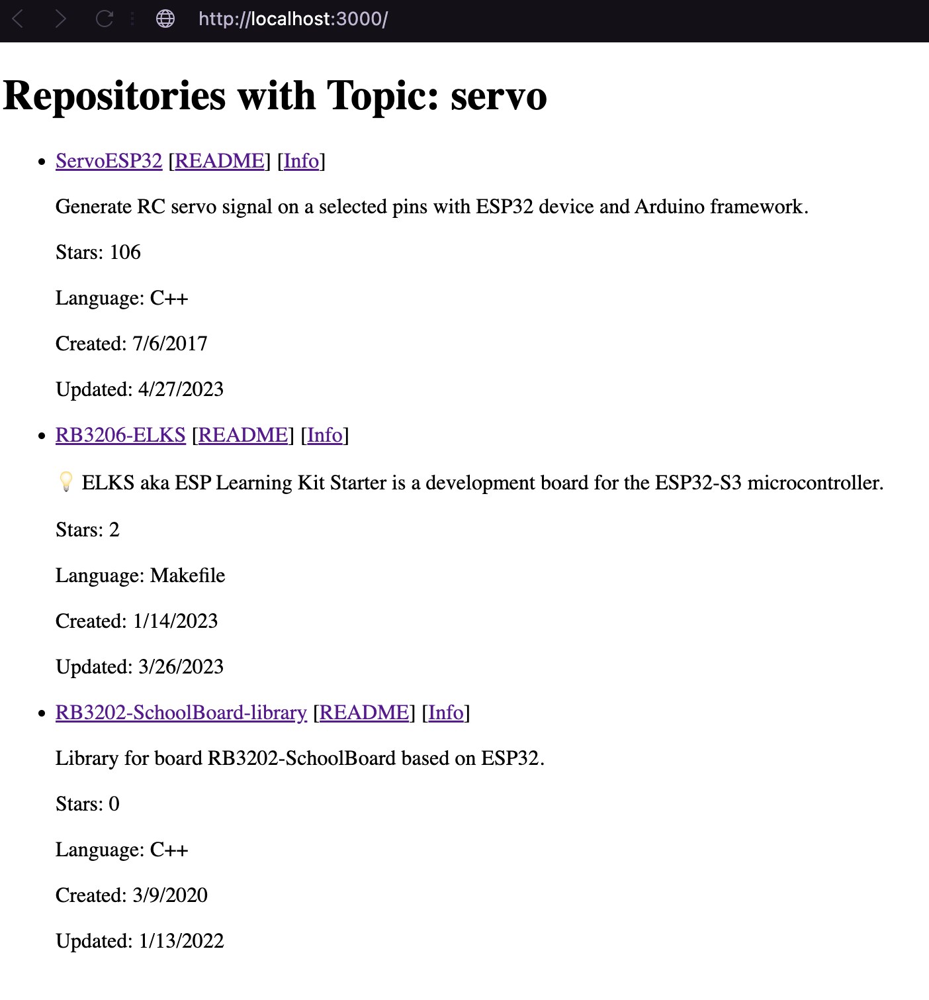
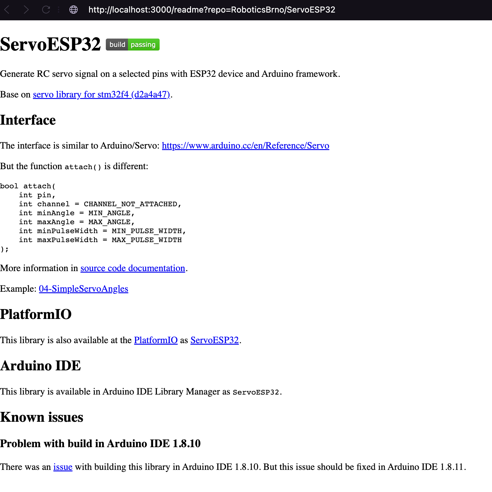
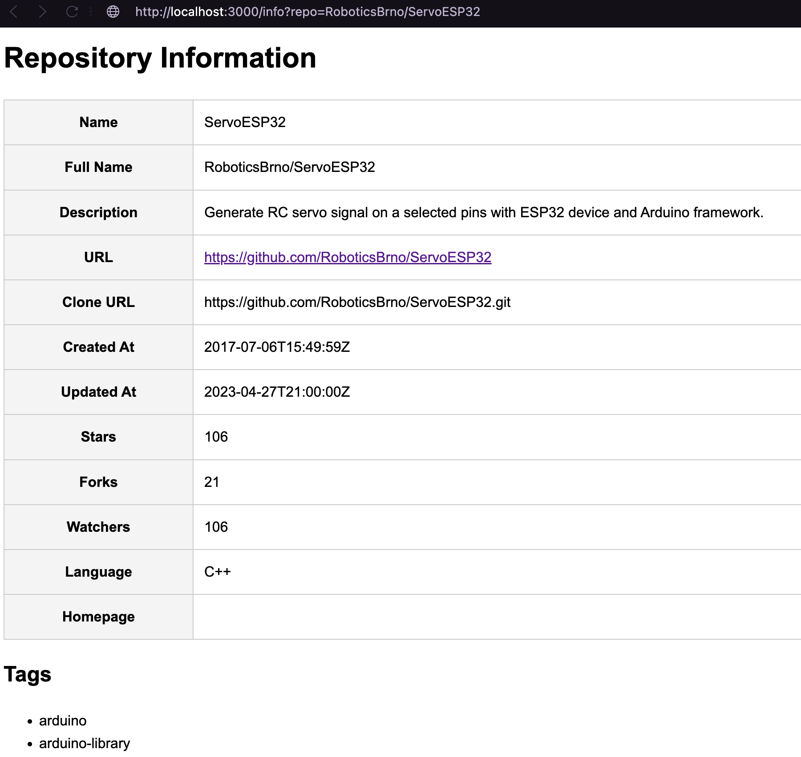

# ProjectIndexer - Fetch data from GitHub API
Basic app to fetch data from GitHub API and serve them on a web page.
The backend is written in TypeScript using Express.js.

## Pre-configuration
You need to create a `.env` file in the root directory of the project and add the following variable:

```env
GITHUB_TOKEN=your_github_token
```
To get a GitHub token, follow the instructions [here](https://docs.github.com/en/github/authenticating-to-github/creating-a-personal-access-token) or a newer `Fine-grained personal access token`.

## Install
`npm install`

## Run
`npm start` or `ts-node app.ts`

## Screenshots
### Home page


### Readme page


### Info page
